# Git-Assignment-01

 First we need to fork the repository from given links : https://github.com/IC-DevOps-Career-Path/ic-devops-batch3?authuser=0

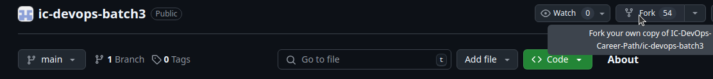

Now we clone the repo to our local device from our forked repository in github, for cloning we do following commands
>git clone git@github.com:al0314/ic-devops-batch3.git

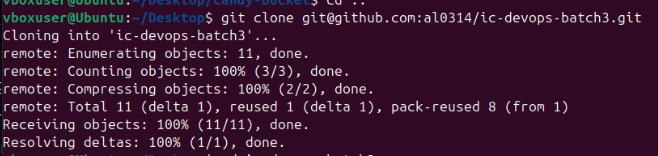

Initate a new branch named "git-assignment-01  
>git checkout -b "git-assignment-01"
  
Add ReadMe.md file in the directory 
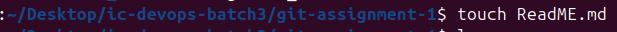

## Git Commands  

>**git init**  
Git init command creates a new git repository.

>**git log**  
Shows all the commited screem logs or project history
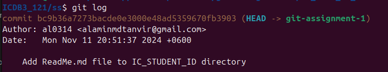  

>**git status**  
check the index and working directory. which changes have been staged or unstaged. Ready to push into remote  
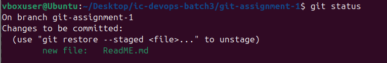  

>**git add .**  
Git add . command track all the changes file. ready to push into the remote origin  
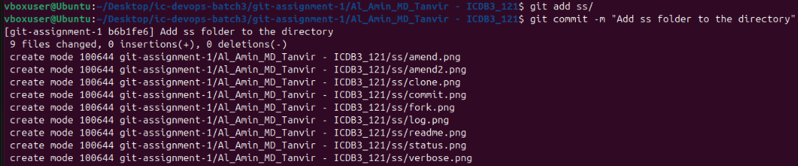

>**git checkout**  
git checkout let you move through branches created by git. 

>**git remote -v**  
git remote verbose let you check origin and host repo for push and fetch 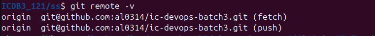    

>**git clone repostory@github**  
let you clone repository into your local device  

>**cd**  
change directory  

>**mkdir**  
Create a new directory   

>**git commit -m "message"**
to commit changes with additional message  
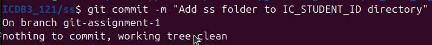  

>**git commit --amend -m "New commit message"**  
Rewrite the most recent commit message   
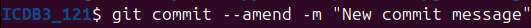  

>**git push origin branch_name**  
a git command that pushes a local branch(es) to a remote repository  
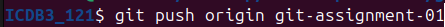

>**git pull origin branch_name**
a git command that fetches from remote repository to a  a local branch  
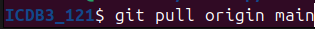  
 

